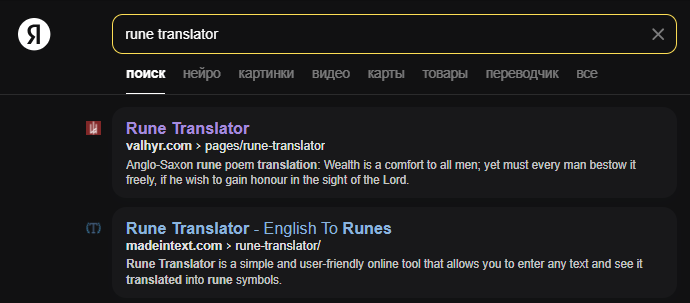
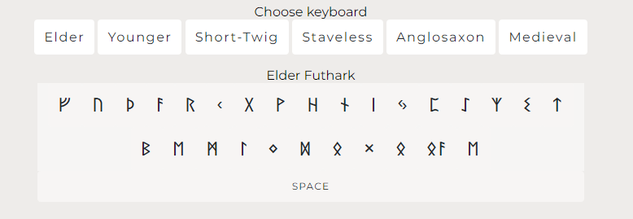
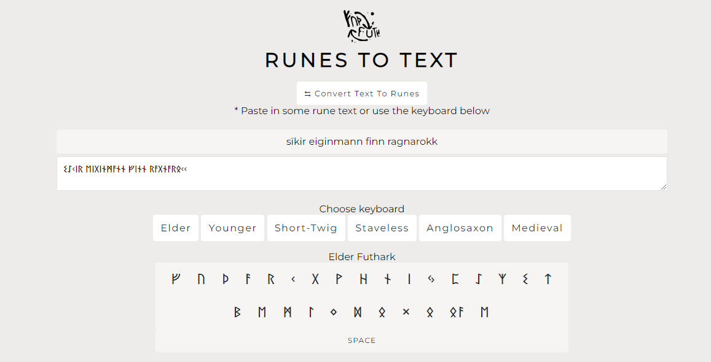
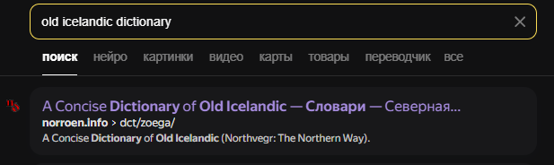
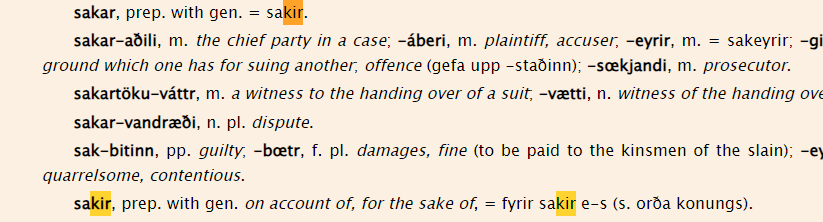
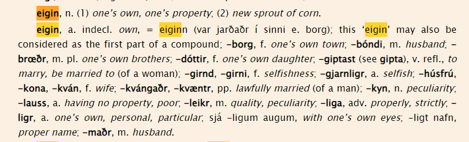
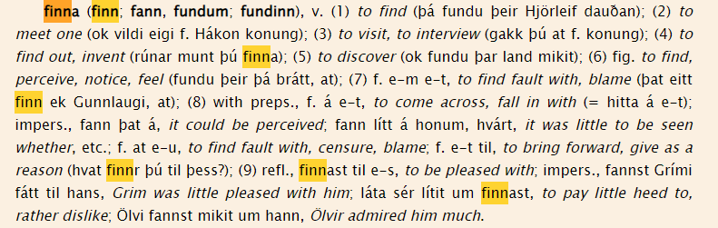

# Task: Elder Futhark

Solve:

Надпись представлена на древнеисландском языке в виде рун. Чтобы перевести это непростое письмо, найдем тематический переводчик:

Основываясь на названии задания, выбираем клавитуру типа "Elder" (древнейший):

Записываем рунические надписи по очереди:

Вырисовывается интересная картина: в конце предложения мы видим слово "ragnarokk", значит мы на верном пути. Транслитерация не идеальна при работе с рунами, поэтому фраза не совсем правильно конвертирована, следует обратиться к древнеисландскому словарю:

Здесь мы находим истинную рашифровку первого слова (ищем по окончанию) - из-за, ради:

В древнеисландском письме слова могут комбинироваться, а также не всегда иметь одинаковые окончания (потому что язык падежный). Таким образом следующее слово ищем по началу:

"eigin" можно дословно перевести как "мой, в моей собтвенности", а окончание -maðr или -mann по отдельности означает "мужчина", в совокупности с первым - "муж, мой мужчина". Следующее слово - "finn":

Таким образом слово можно перевести как "нашла, открыла, вообразила". Последнее слово же в переводе не нуждается. Получаем фразу "Из-за мужа открыла Рагнарек".

Flag: `EclipseCTF{husband}`