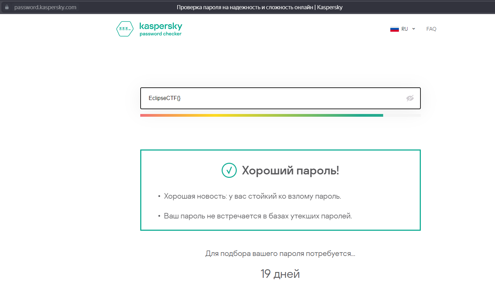
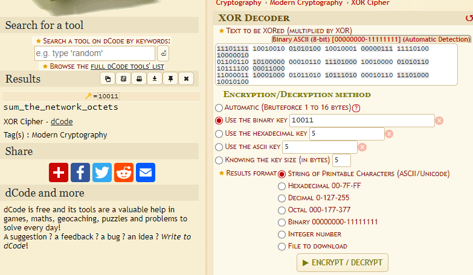
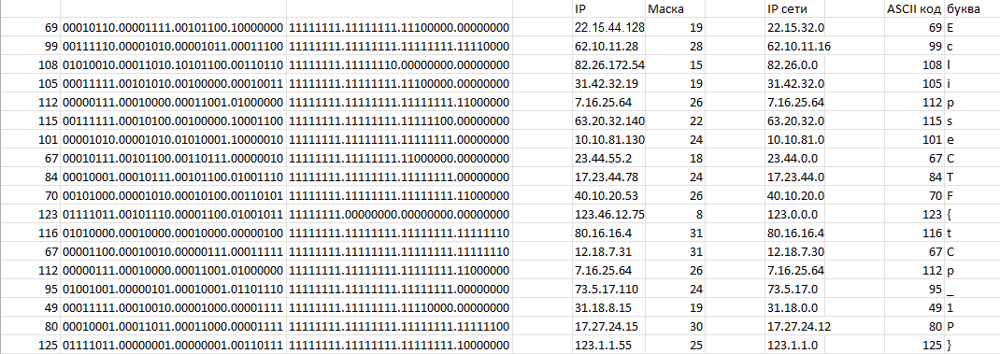

# Task: Network_is_awesome 

Solve:

Подсказка  - ключ - необходимо найти сайт Касперского, где проверяются пароли на криптостойкость (https://password.kaspersky.com/ru/);  - вопрос - столько дней потребуется, чтобы взломать пароль, если бы он был оберткой нашего флага - т.е. EclipseCTF{};  - это - число 19:

Его переводим в двоичную систему - 10011;  - сама подсказка - это XOR, ключ - указан выше. После расшифровки получается "sum_the_octets". 

Сам таск представляет собой список IP-адресов и масок подсети. Самое сложное - догадаться, что с этим делать. Что надо сделать, если видишь IP и маску? Правильно, найти адрес сети; судя по подсказке, надо просуммировать октеты адреса сети;  - получается список чисел. 3. Если видим в списке чисел числа 123 и 125 - это точно ASCII.

Конвертируем ASCII в текст, получаем флаг:

Flag: `EclipseCTF{tCp_1P}`
