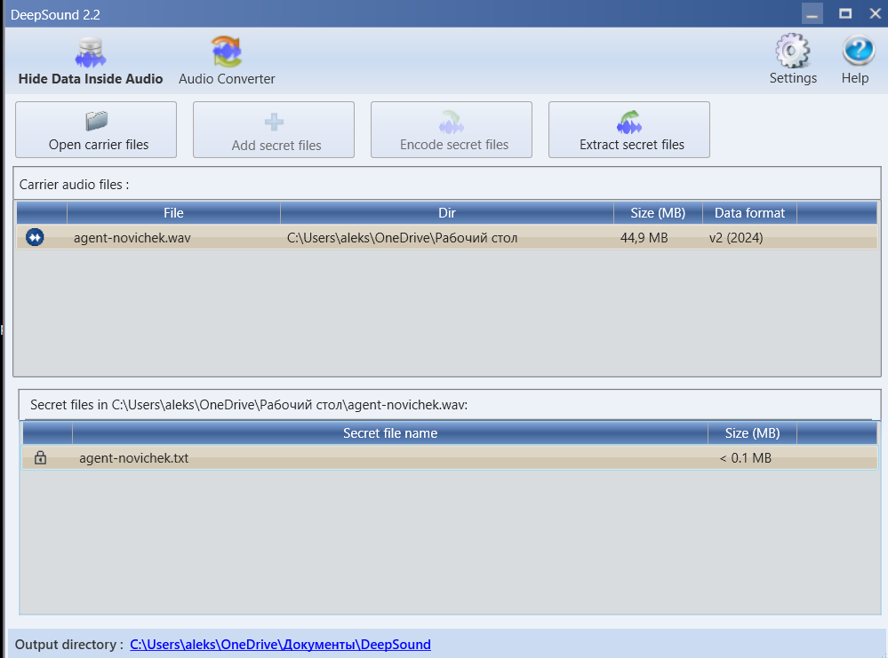

# Task: Агент-новичок

Solve:

Установить DeepSound, загрузить туда WAV файл, ввести пароль (это имя файла и таска, на это намекает стих)

После этого будет загружен файл agent-novichek.txt, который содержит в себе зашифрованный флаг

Текст в txt: `EpTas__}cisCFes_7g1ryule{yeoo`

Это шифр Rail Fence, о нем также упомянуто в стихотворении

И закинув в декодер эту фразу получаем флаг

Flag: `EclipseCTF{easy_s7eg_1or_you}`