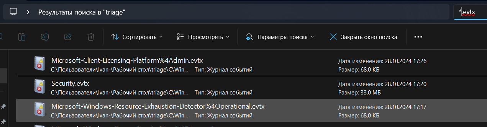
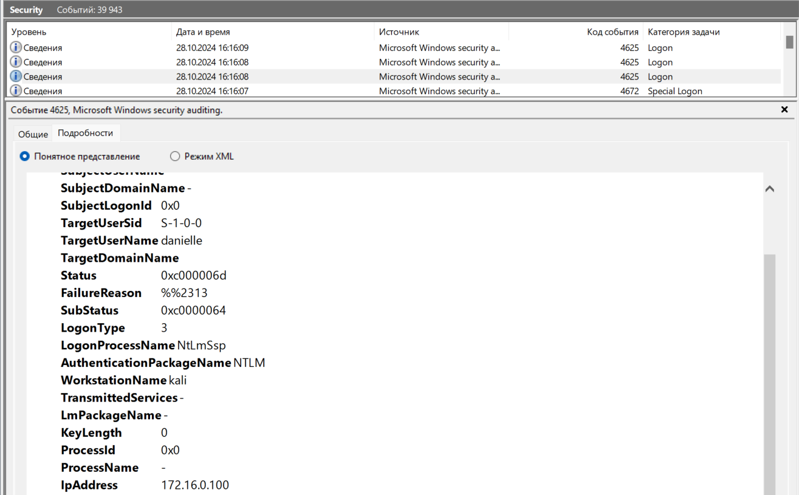
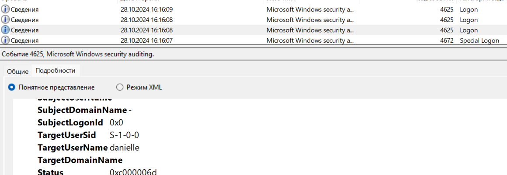
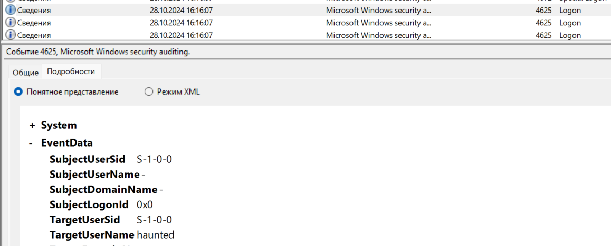
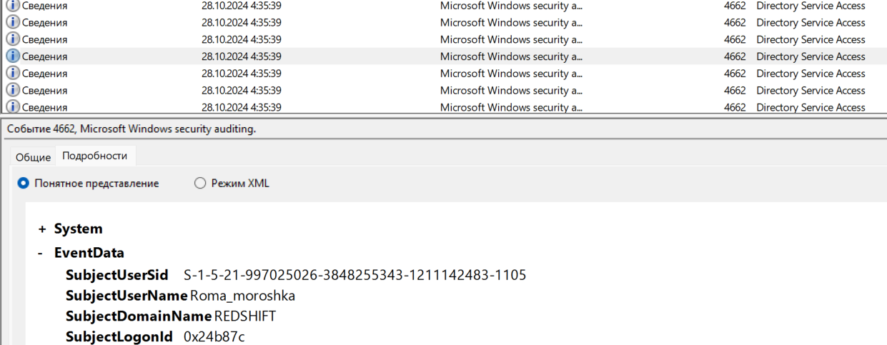
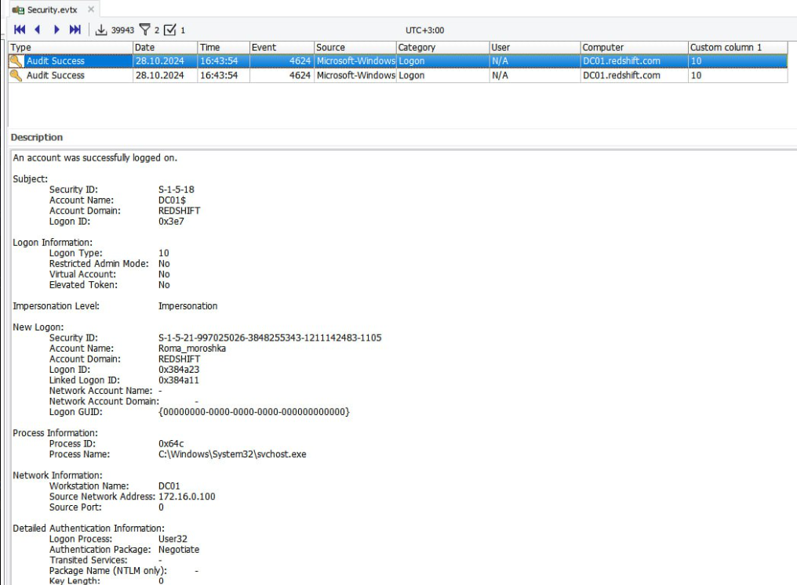
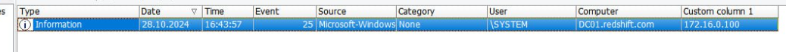
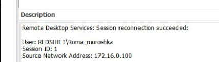
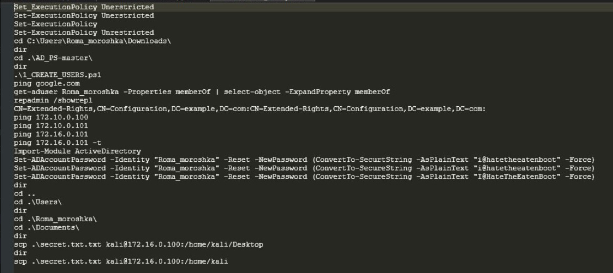

# Task: Forensics Travel 1-6

Solve:

Для начала, надо найти журналы событий (формат `*.evtx`), а конкретно, нам нужен `Security.evtx`:

```
triage\C\Windows\System32\winevt\Logs\Security.evtx
```





Просматривая логи, находим событие 4625, где обращение происходит со стороны рабочей станции kali с IP-адресом 172.16.0.100.

Forensics Travel 1 Flag: `EclipseCTF{172.16.0.100}`

---

Замечаем, что много попыток `Logon` со стороны вышеупомянутой рабочей станции. При этом, перебирается множество пользователей, что говорит нам об атаке `Password_spraying`





Обращаем внимание на параметр `TargetUserName`

Forensics Travel 2 Flag: `EclipseCTF{Password_spraying}`

---

Далее крайне много событий фиксируется со стоороны пользователя `Roma_moroshka`



Forensics Travel 3 Flag: `EclipseCTF{Roma_moroshka@redshift.com}`

---

Скомпрометированный пользователь, от лица которого действует злоумышленник получил доступ к контроллеру домена через RDP (Logon Type 10):








Forensics Travel 4 Flag: `EclipseCTF{RDP}`

---

Далее нам надо найти файл `triage\C\Users\Roma_moroshka\AppData\Roaming\Microsoft\Windows\PowerShell\PSReadline\ConsoleHost_history.txt`



Видно, что злоумышленник пытался сменить пароль средствами `Set-ADAccountPassword`


Forensics Travel 5 Flag: `EclipseCTF{Set-ADAccountPassword}`

---

На скрине выше также видно, что злоумышленник скопировал себе файл средствами `scp`


Forensics Travel 4 Flag: `EclipseCTF{scp}`

---