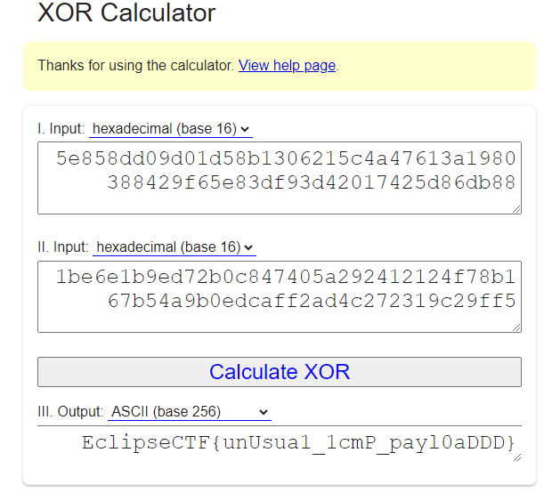

# Task: Secure channel

Solve:

Для начала следует ознакомиться с файлом enc.log:

Это ни что иное, как log-файл закрытых TLS/SSL ключей, а значит нужно расшифровать трафик, представленный в secure_channel.pcap. Для этого нужно перейти в Правка - Параметры - Protocols - TLS, в окно (Pre)-Master-Secret log filename, вставить путь к log-файлу:

Теперь сессия расшифрована, появились 2 HTTP-запроса, в одном из них передается файл secret.key:

Далее можно либо отследить TLS Stream, либо экспортировать файл. В любом случае мы полуаем ключ (5e858dd09d01d58b1306215c4a47613a1980388429f65e83df93d42017425d86db88):

Проанализировав трафик, можно понять, что ICMP-пакетов достаточно много, и идут они друг за другом. Развернув информацию об ICMP-пакете, можно увидеть, что в Data-сегменте каждого запроса/ответа содержится hex-строка длиной 4:

Финальный этап решения заключается в том, чтобы последовательно выписать все данные из ICMP-пакетов, составив строку аналогичной ключу длины (1be6e1b9ed72b0c847405a292412124f78b167b54a9b0edcaff2ad4c272319c29ff5), затем выполнить между ними XOR. Таким образом тайна разгадана:

Flag: `EclipseCTF{unUsua1_1cmP_payl0aDDD}`