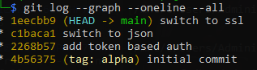
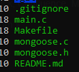
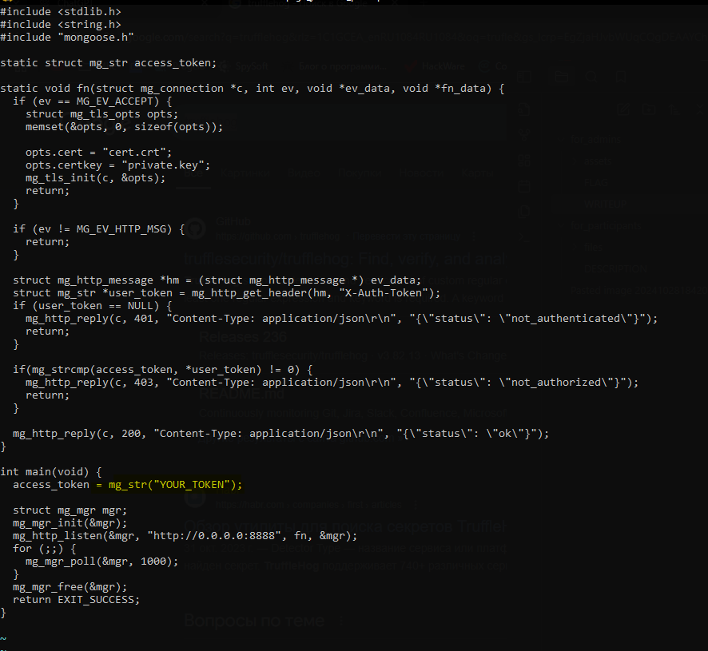
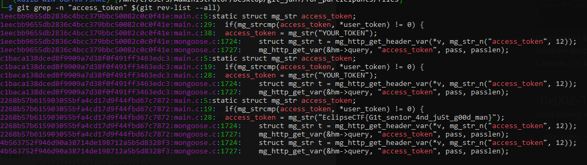

# Task: git_happens

Solve:

Краткая суть: найти флаг в прошлых коммитах

На одном из прошлых наших ивентов уже был таск на гит, в нём требовалось найти dangling-коммит. Этот таск с одной стороны проще, а с другой сложнее. Для тех кто знаком с гитом - проблем не вызовет

Участнику передаётся репозиторий гита, репа имеет крайне простую структуру



Наша задача найти секрет который спрятан в прошлых коммитах, простая задача человека который слышал про git-secrets или trufflehog

Осмотрим репозиторий в том состоянии в котором он есть



Интерес представляет main.c



Наш секрет который "затёрли", теперь нужно просканировать репозиторий на предмет секретов. Сделать это можно несколькими способами, в данном райтапе покажу самый простой и понятный, из базового функционала гита. Можно сделать через trufflehog, gitleaks, git secrets и т.д. Зная или примерно понимая строку, которую мы ищем, можно просто сделать grep:

```
git grep -n "access_token" $(git rev-list --all)
```



Flag: `EclipseCTF{G1t_sen1or_4nd_ju5t_g00d_man}`
