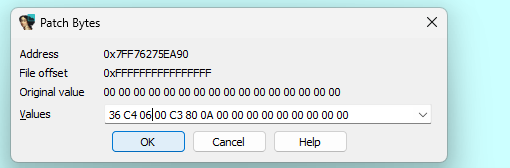

# Task: PacMan

Solve:

1. Смотрим, что к нас в цикле main и можно заметить функцию, которая вызывается странным образом, не влияя на сам игровой движок и на саму игру

2. Вот как это, собственно, выглядит в псевдокоде:

3. Перейдя в эту функцию, можно увидеть антиоткладочные проверки 

4. Но можно заметить, что какие-то два странных числа кладутся в ячейку памяти

5. Пропатчим данный вызов и попробуем скипнуть проверку на дебаг

6. Далее вернемся к тем ячейкам памяти и посмотрим, где они вызываются еще. Нажодим их вызов в функции 5050

7. Далее пробуем найти функцию, в которой как раз происходит игровая логика. Глянем функцию 57Е0

8. Анализируя функцию, натыкаемся на проверку, при прохождения которой заканчивается работа программы, но перед этим вызывается функция, глянем, что там

9. Также можно найти эту функцию по стрингам

10. Видим ту функцию 5050 и, осмотрев ее поподробнее, понимаем, что, скорее всего, в ней происходид расшифровка флага

11. Поставим брейкпонинт перед проверкой победы

12. Начнем дебаг, первым делом патчим мусор, который у нас остался на месте вызова функции, а также скипаем проверку победы и переходим к функции расшифровки флага

12. Доходим до тех переменных, в которых должны класться ключи и меняем в памяти нули на нужные нам значения 

12. Дадее доходим до куска, где данные передаются в переменную и можем увидеть в буфере расшифрованный флаг

Flag: `EclipseCTF{ant!_ch3at_I$_d3feat3d}`
