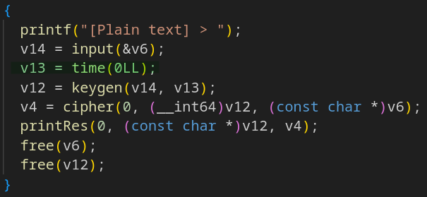

# Task: Что-то на Франко-Американском

Solve:

Что имеем
- Текстовый файл encrypted.txt
- Бинарный файл task.bin


В нём мы видим:
- Дату создания
- Отсутвующий ключ
- Шифротекст

Бинарник является исполняемым ELF файлом

Закидываем файл task.bin в декомпилятор, находим функции отвечающие за генерацию ключа и шифрование.

```C
// Функция генерации ключа
char *keygen(size_t size, long key_seed){
	char *key = (char *)malloc(size * sizeof(char));
	if (key == NULL){
		printf("keygen: Allocation Error!\n");
		exit(1);
	}

	srand(key_seed);

	for (int i = 0; i < (int)size; i++){
		key[i] = 32 + rand() % (127 - 32);
	}

	return key;
}
```

```C
//Функция шифрования
char *cipher(uint8_t mode, char * key, char * text) {
	// 0 - шифрование, 1 - расшифрование 
	char *resault = (char *)malloc((strlen(text) + 1) * sizeof(char));

	if (resault == NULL){
		printf("cypher: Allocation Error!\n");
		exit(1);
	}

	strcpy(resault, text);

	for(int i = 0; i < (int)strlen(text); i++){
        if (mode == 0) { // шифрование
            resault[i] = 32 + ((text[i] + key[i] - 64) % 94);
        } else { // расшифрование
            int temp = text[i] - key[i];
            if (temp < 0) {
                temp += 94;
            }
            resault[i] = 32 + (temp % 94);
        }
        
    }

	return resault;	
}
```

Для функции keygen видим, что один из аргументов функции - это сид ключа. Откуда он берётся? Из вызова в main, где в качестве этого аргумента передаётся **время**.



Вспоминаем, что у нас имеется дата создания файла, поэтому достаём timestap 2шт, за день до и за день после (на всякий) и пишем эксплоит, который будет перебирать все варианты ключа с поиском нужного по поиску подстроки Eclipse{.

Пример эксплоита:
```C
#include <stdint.h>
#include <stdio.h>
#include <stdlib.h>
#include <string.h>

char *keygen(size_t size, long key_seed){
	char *key = (char *)malloc(size * sizeof(char));
	if (key == NULL){
		printf("keygen: Allocation Error!\n");
		exit(1);
	}

	srand(key_seed);

	for (int i = 0; i < (int)size; i++){
		key[i] = 32 + rand() % (127 - 32);
	}

	return key;
}

char *cipher(uint8_t mode, char * key, char * text) {
	// 0 - шифрование, 1 - расшифрование 
	char *resault = (char *)malloc((strlen(text) + 1) * sizeof(char));

	if (resault == NULL){
		printf("cypher: Allocation Error!\n");
		exit(1);
	}

	strcpy(resault, text);

	for(int i = 0; i < (int)strlen(text); i++){
        if (mode == 0) { // шифрование
            resault[i] = 32 + ((text[i] + key[i] - 64) % 94);
        } else { // расшифрование
            int temp = text[i] - key[i];
            if (temp < 0) {
                temp += 94;
            }
            resault[i] = 32 + (temp % 94);
        }
        
    }

	return resault;	
}

int input(char **str) {
    long int len = 0;
    long int size = 8;
    *str = (char *)malloc(size * sizeof(char));

    if (*str == NULL) {
        printf("Initial allocation error\n");
        exit(1);
    }

    char ch;
    while ((ch = getchar()) != '\n' && ch != EOF) {
        if (len + 1 >= size) {
            size += 8;
            char *tmp = (char *)realloc(*str, size * sizeof(char));

            if (tmp == NULL) {
                printf("Reallocation error\n");
                free(*str);
                exit(1);
            }
            *str = tmp;
        }
        (*str)[len++] = ch;
    }

    (*str)[len] = '\0';
    return len;
}

int main(){

	// timestamp 1729890000 - 1730062800

	char *targ_str = "EclipseCTF{";
	char *encrypted_str;
	input(&encrypted_str);
	for (int i = 0;;i++){
		int key_seed_try = 1729890000 + i;
		char *key_try = keygen(strlen(encrypted_str), key_seed_try);

		printf("[~] Trying key_seed <%d> ", key_seed_try);

		char *decr_try = cipher(1, key_try, encrypted_str);

		if (strstr(decr_try, targ_str) != NULL){
			printf("success!\n");
			printf("[+] Key seed: %d\n", key_seed_try);
			printf("[+] Key: %s\n", key_try);
			printf("[+] Decrypted text: %s\n", decr_try);
			break;
		} else {
			printf("failed ...\n");
			// printf("[-]: %s", decr_try);
		}
		
		if (key_seed_try > 1730062800) break;

		free(key_try);
		free(decr_try);
	}
	
	free(encrypted_str);

    return 0;
}
```

Запускаем, ждём, и получаем флаг:


Flag: `EclipseCTF{P0chuv5tvu1_5v0u_050zn4nn05t}`