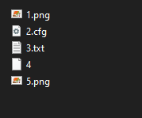
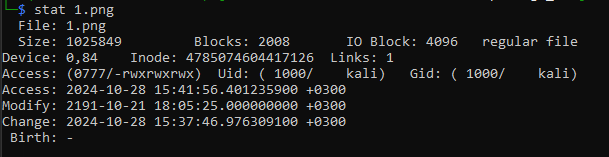
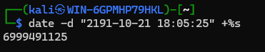
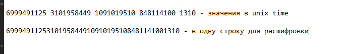
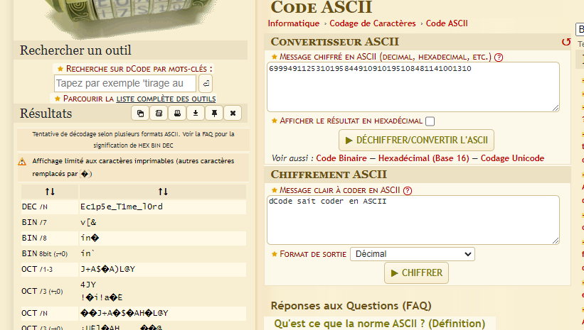

# Task: 1970-01-01

Solve:

Название таска отсылает к unix формату времени начинающего посекундный отсчёт от этой даты. 

Краткая суть таска - снять временные метки с файлов, перевести их в unix-time формат и декодировать как ASCII текст.

Файлы для участников, сами файлы бесполезны. В них полезна только временная метка изменения файла.



Используя утилиту stat в линукс смотрим mtime(modification time) 
Обратите внимание на смещение времени GMT+3, я живу по временному поясу МСК поэтому у меня такое. Если вы живёте по другому то используйте -u для времени по UTC+0

```
stat {file_name}
```



Далее с помощью утилиты date переводим формат времени в unixtime

```
date -d "2191-10-21 18:05:25" +%s
```



собираем с пяти файлов временные метки и получаем строки данного вида



```
6999491125 3101958449 1091019510 848114100 1310

6999491125310195844910910195108481141001310
```

Используя Dcode.fr пробручиваем значения пробелов и получаем наш флаг без обёртки



```
Ec1p5e_T1me_l0rd
```

Оборачиваем и сдаём

Flag: `EclipseCTF{Ec1p5e_T1me_l0rd}`