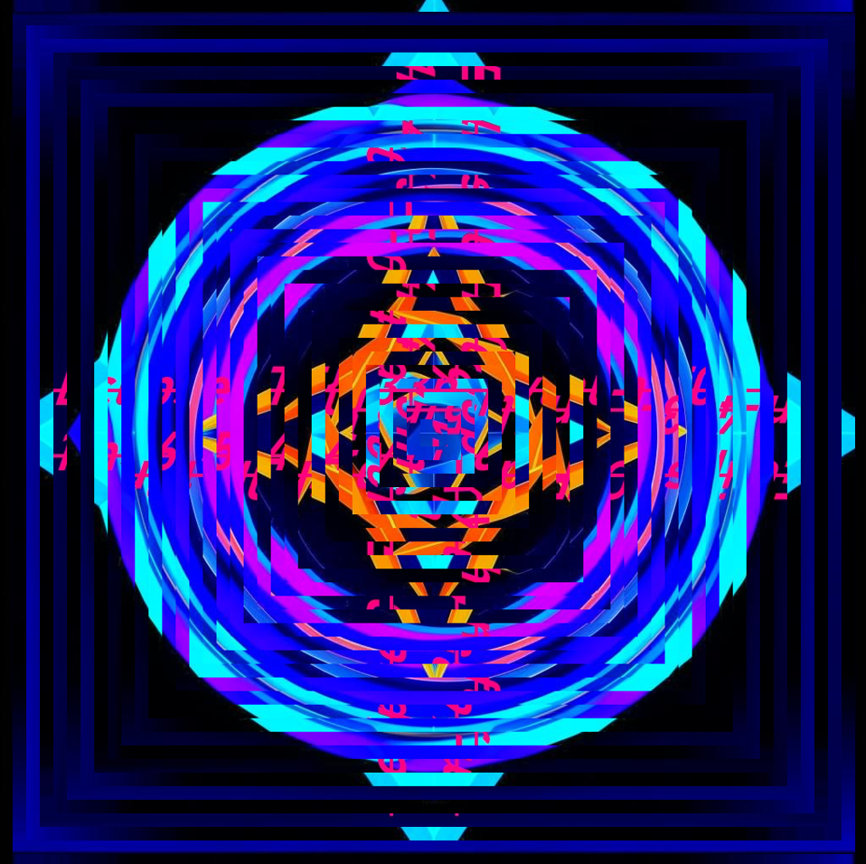
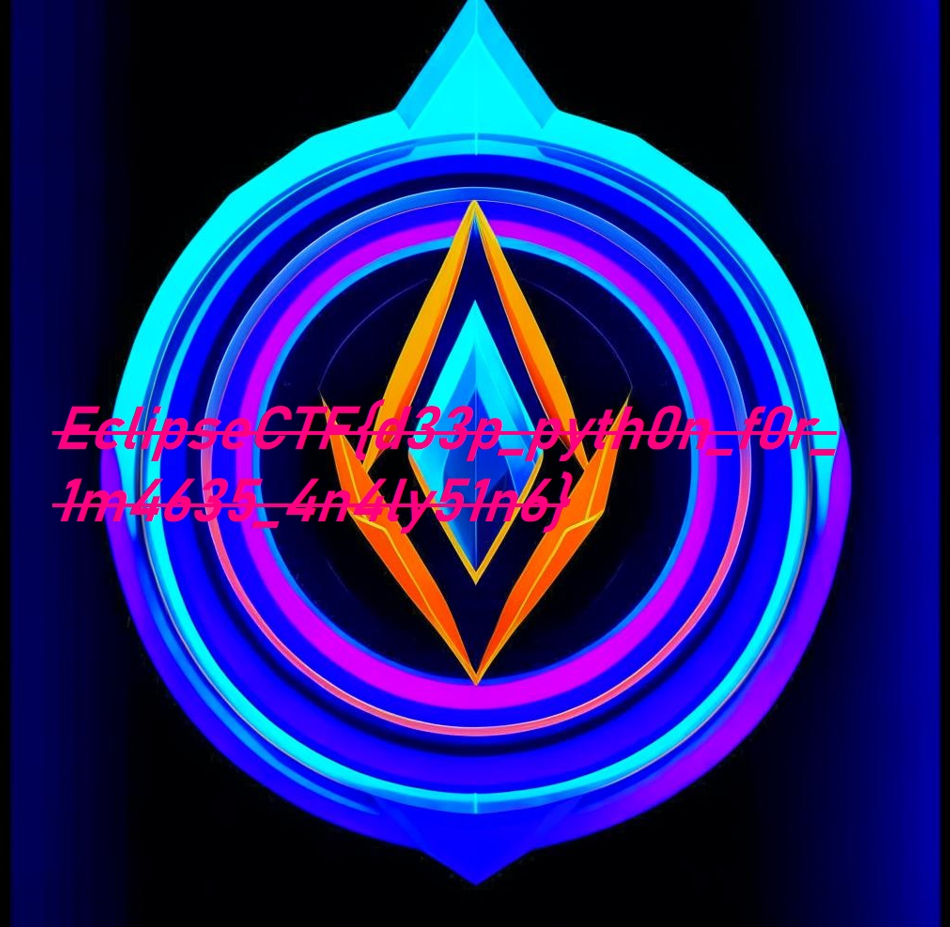

# Task: Rottier-2

Solve:

Игрокам выдано следующее искаженное изображение:



В описании задания есть 1 подсказка:
1) Полосы по 16px в ширину

При этом, если внимательно посмотреть, то работа происходит именно с квадратами, грани которого в ширину составляют 16px. Нам надо немного модифицировать код, который мы написали ранее в таске Rottier. Ключевое - выделять области квадратов с гранями по 16px в ширину, а также понять момент с вращением. Момент с вращением не совсем может быть очевиден, но ротаций может быть всего 4 (а как иначе мы повернем квадрат (90, 180, 270, 0 градусов)), но вот в какую сторону? Это предстоит выяснить опытным путем. Также, может возникнуть вопрос с последовательностью углов, тогда вариантов прибавится, но таск специально спроектирован так, чтобы решение было наиболее логичным, поэтому вращение происходит от края до середины (речь о том, откуда начинается отсчет областей), по следующему алгоритму => `[0, -270, -180, -90]`, т.е. 1-ая квадратная область, считая от края, поворачивается на 0 градусов, 2-ая - на -270, 3-я - на -180 и 4-ая на -90. А дальше остается повторять до центра самого изображения.

```python
from PIL import Image

def restore_image_layers(image_path, layer_width=16):
    # Открываем изображение
    with Image.open(image_path) as img:
        width, height = img.size
        
        # Проверяем, что изображение 1024x1024
        if width != 1024 or height != 1024:
            print("[-] Изображение должно быть 1024x1024 пикселей.")
            return
        
        # Создаем новое изображение для сохранения результата
        restored_img = img.copy()
        
        # Углы восстановления в том же порядке, что и для оригинального вращения
        rotations = [0, -270, -180, -90]  # Начнем с 0° и обратный порядок
        rotation_index = 0  # Начальный индекс вращения для восстановления
        
        # Начинаем восстановление с краев к центру
        num_layers = width // (2 * layer_width)  # Число слоев по ширине 16 пикселей
        
        for layer in range(num_layers):
            # Вычисляем координаты текущего слоя
            left = layer * layer_width
            upper = layer * layer_width
            right = width - (layer * layer_width)
            lower = height - (layer * layer_width)
            
            # Извлекаем слой (внешний квадрат)
            block = img.crop((left, upper, right, lower))
            
            # Поворачиваем слой на обратный угол
            rotated_block = block.rotate(rotations[rotation_index])
            
            # Вставляем восстановленный слой обратно
            restored_img.paste(rotated_block, (left, upper))
            
            # Переходим к следующему углу поворота
            rotation_index = (rotation_index + 1) % len(rotations)
        
        # Сохраняем восстановленное изображение
        restored_img_name = 'restored_image.png'
        restored_img.save(restored_img_name)
        print(f"[+] Восстановленное изображение сохранено как {restored_img_name}")

# Пример использования
rotated_image_path = 'layer_rotated_image.png'  # Путь к повернутому изображению
restore_image_layers(rotated_image_path, 16)
```



Flag: `EclipseCTF{d33p_pyth0n_f0r_1m4635_4n4ly51n6}`
