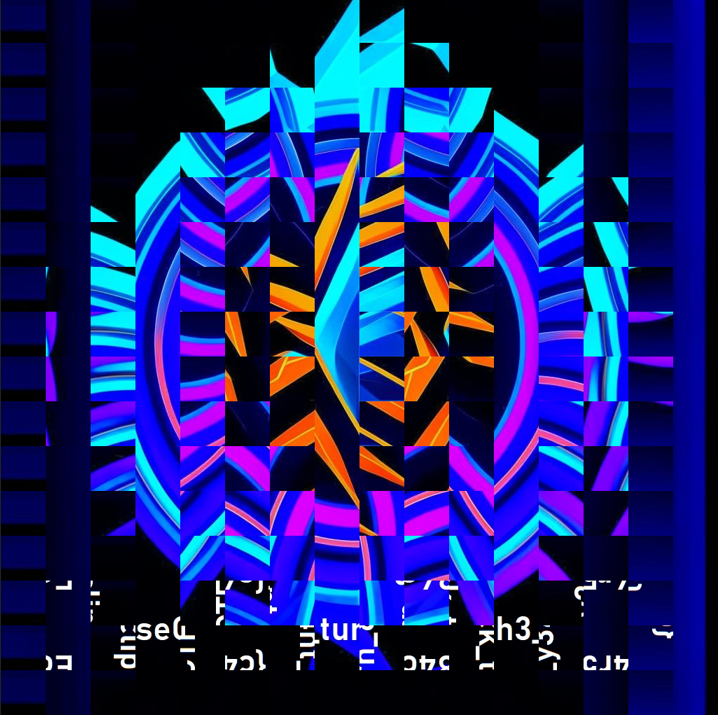
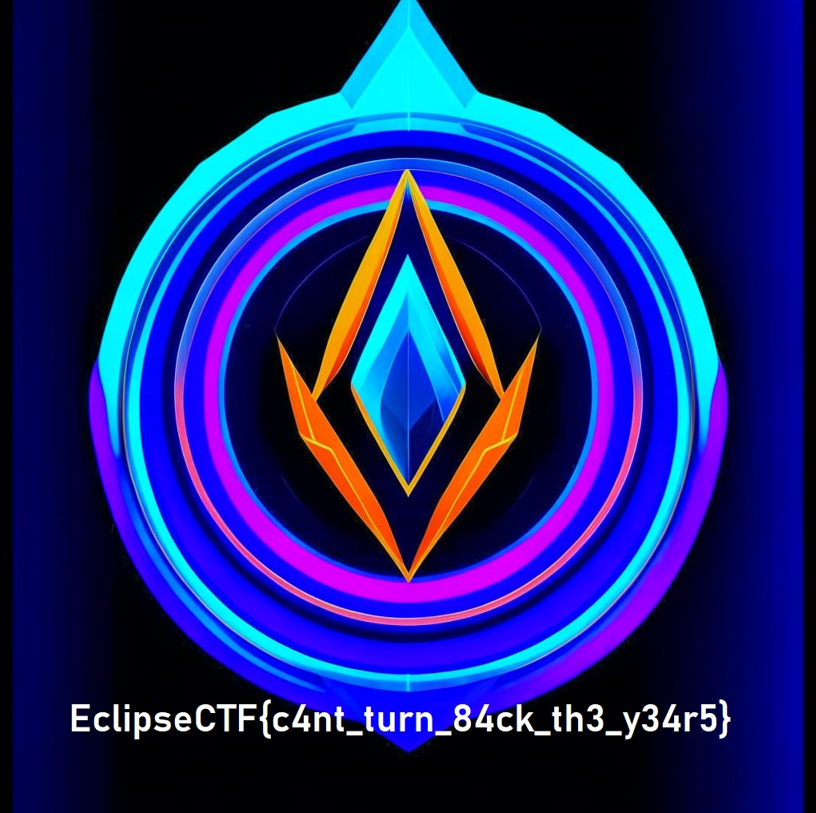

# Task: Rottier

Solve:

Игрокам выдано следующее искаженное изображение:



В описании задания есть 2 подсказки:
1) Квадраты, которые непосредственно переворачиваются имеют размерность 64x64 пикселя
2) Повороты производятся на 90 градусов

Если посмотреть на изображение, а именно в область, где располагается текст, то можно понять, что поворот происходит не просто на 90 градусов, а на 90 градусов относительно поворота предыдущего квадрата, да еще и в направлении против часовой стрелки, т.е. повороты квадратов реализуются в следующем порядке: `[-90, -180, -270, 0]`. Самое решение выглядит следующим образом:

```python
from PIL import Image

# Функция для обратного поворота квадратов изображения
def reverse_rotate_image_blocks(image_path, block_size):
    # Открываем повернутое изображение
    with Image.open(image_path) as img:
        width, height = img.size
        
        # Проверяем, что изображение 1024x1024
        if width != 1024 or height != 1024:
            print("[-] Изображение должно быть 1024x1024 пикселей.")
            return
        
        # Создаем новое изображение для восстановления
        restored_img = Image.new('RGB', (width, height))
        
        # Устанавливаем углы обратного вращения в порядке
        reverse_rotations = [-90, -180, -270, 0]  # Повороты в обратном порядке
        rotation_index = 0  # Начальный индекс обратного вращения

        # Перебираем блоки 64x64 по всему изображению
        for y in range(0, height, block_size):
            for x in range(0, width, block_size):
                # Извлекаем блок 64x64
                block = img.crop((x, y, x + block_size, y + block_size))
                
                # Поворачиваем блок на обратный угол
                rotated_block = block.rotate(reverse_rotations[rotation_index])
                
                # Вставляем восстановленный блок в результирующее изображение
                restored_img.paste(rotated_block, (x, y))
                
                # Переходим к следующему углу обратного поворота
                rotation_index = (rotation_index + 1) % len(reverse_rotations)
        
        # Сохраняем восстановленное изображение
        restored_img_name = 'restored_image.png'
        restored_img.save(restored_img_name)
        print(f"[+] Восстановленное изображение сохранено как {restored_img_name}")

# Пример использования
rotated_image_path = 'rotated_image.png'  # Путь к повернутому изображению
reverse_rotate_image_blocks(rotated_image_path, 64)
```



Flag: `EclipseCTF{c4nt_turn_84ck_th3_y34r5}`
