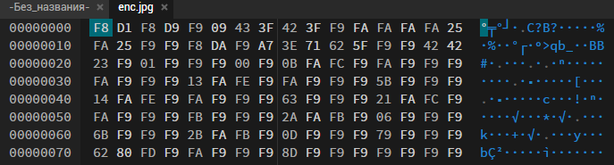
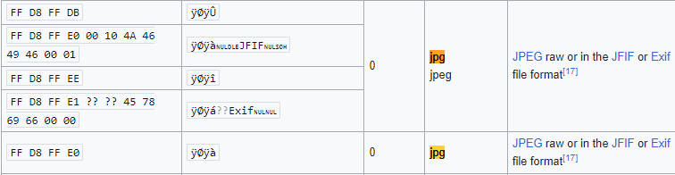
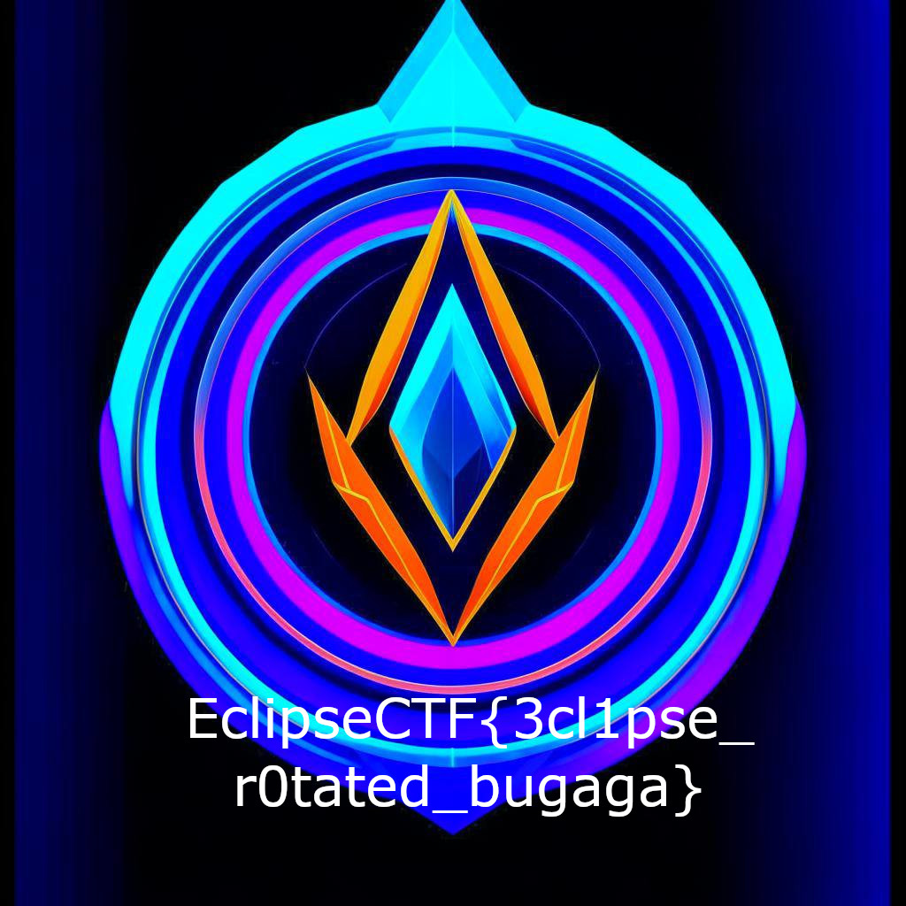

# Task: Ambush, rotate!

Solve:

Нужно проанализировать байтовую структуру полученного файла:



Полученный файл имеет формат .jpg, проверим как выглядит сигнатура подобных файлов на https://en.wikipedia.org/wiki/List_of_file_signatures:



Можно заметить тенденцию - каждый байт в полученной картинке отличается на -7. Еще раз посмотрев на название таска можно удостовериться - это алгоритм ROT со смещением -7, значит нужно написать код, который будет выполнять обратное смещение на +7. Пример подобного кода представлен в файле decrypt.py и ниже:

```python3
def rot_plus_7(byte):
    # Применяем ROT +7 (сдвигаем байт на +7)
    return (byte + 7) % 256

def apply_rot_plus_7_to_file(input_file, output_file):
    with open(input_file, 'rb') as f:
        # Читаем содержимое файла
        data = f.read()

    # Применяем ROT +7 к каждому байту
    transformed_data = bytearray(rot_plus_7(byte) for byte in data)

    with open(output_file, 'wb') as f:
        # Записываем измененные данные в новый файл
        f.write(transformed_data)

# Использование функции
input_filename = 'enc.jpg'
output_filename = 'new.jpg'
apply_rot_plus_7_to_file(input_filename, output_filename)

print(f'Файл {input_filename} успешно преобразован с ROT +7 и сохранен как {output_filename}.')
```

По итогу выполнения скрипта получаем исходную картинку, показанную ниже:



Flag: `EclipseCTF{3cl1pse_r0tated_bugaga}`