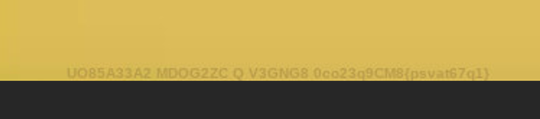
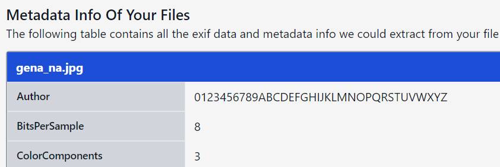
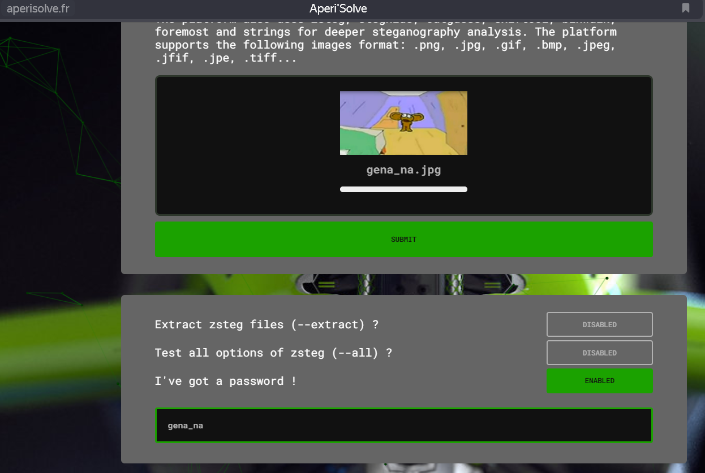
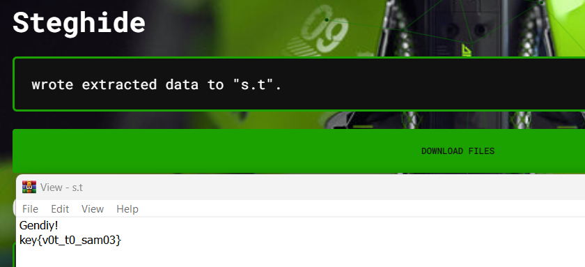
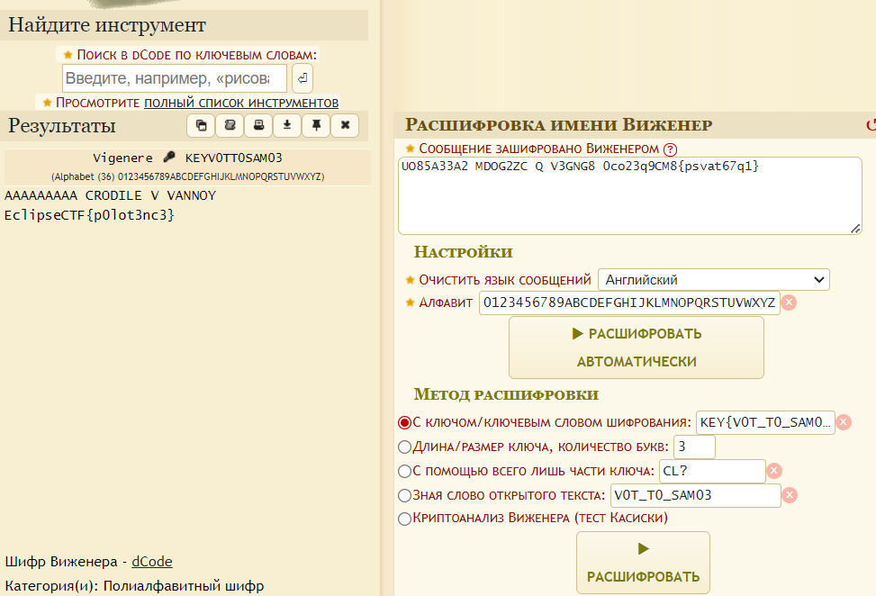

# Task: gena_na

Solve:

Смотрим на саму картинку повнимательнее, внизу находим шифротекст, сохраняем его

```
UO85A33A2 MDOG2ZC Q V3GNG8 0co23q9CM8{psvat67q1}
```



Смотрим метаданные и видим, что какой то у неё странный автор (это алфавит для расшифровки)

```
0123456789ABCDEFGHIJKLMNOPQRSTUVWXYZ
```



Сканим через steghide, он требует пароль. Пароль - название таска



Получаем файл s.t, в нём лежит ключ расшифровывания для текста, сохранённого ранее

```
Gendiy!
key{v0t_t0_sam03}
```



На dcode.fr ищем шифр Виженера, вставляем туда шифротекст, ключ и алфавит;



Profit!

Flag: `EclipseCTF{p0lot3nc3}`
