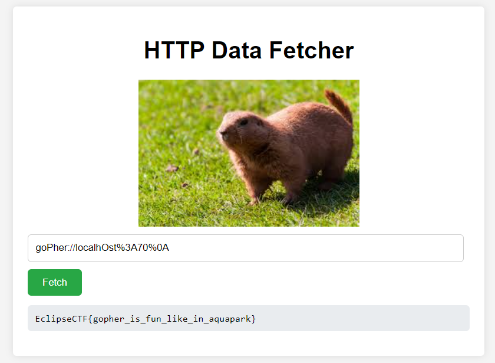

# Task: Забавность

Solve:

1) Фото - это Гофер, делается вывод о том, что используемый протокол - gopher
2) robots.txt содержит localhost:70, значит, надо ориентироваться на порт 70
3) Если вставить в поле ввода https://google.com, то сервис выведет response.text 
4) gopher://localhost:70 -> выдает "Error: Request blocked by WAF.", делается вывод о том, что надо обойти WAF
5) goPher://localhOst%3A70%0A - как пример перебора дефотных вещей для обхода WAF (https://github.com/swisskyrepo/PayloadsAllTheThings/blob/master/Server%20Side%20Request%20Forgery/README.md)
6) Flag

Flag: `EclipseCTF{gopher_is_fun_like_in_aquapark}`